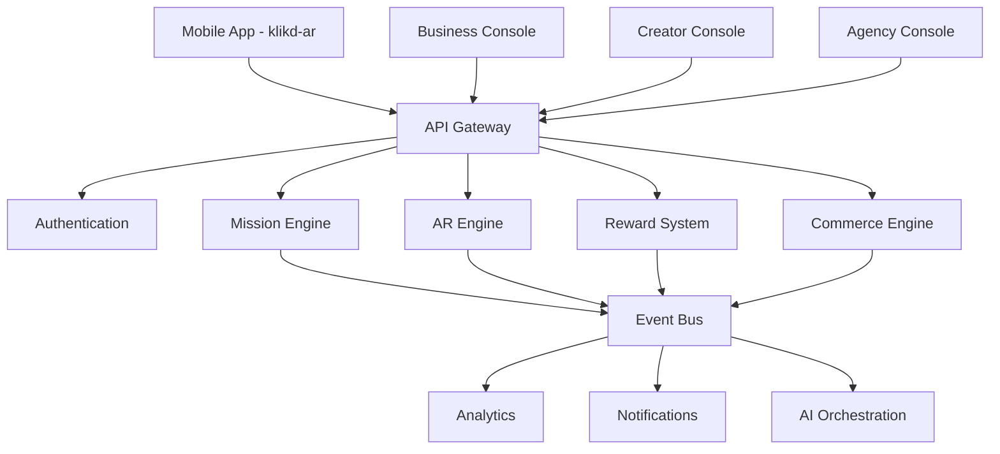
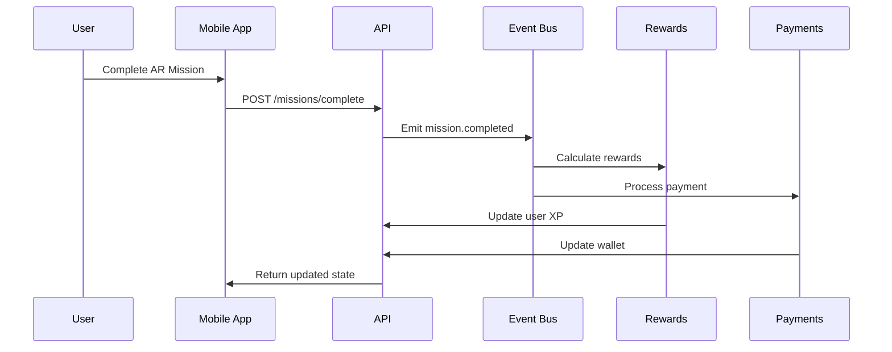

# Architecture Overview

## System Architecture

Klikd follows an event-driven, microservices architecture with AR-first design principles.

### High-Level Components

### Event-Driven Flow

**Mission Completion → Events → Rewards → Payments**

1. **Mission Trigger**: User completes AR interaction or social action
2. **Event Emission**: `@klikd/events` publishes structured event
3. **Reward Calculation**: `@klikd/gamification` processes XP/rewards
4. **Payment Processing**: `@klikd/commerce` handles monetary rewards
5. **Analytics Tracking**: `@klikd/analytics` records user behavior

### Data Flow

### Multi-Tenant Architecture

- **Tenant Isolation**: Database-level isolation with tenant_id
- **Plan Enforcement**: Rate limiting and feature flags per plan
- **Regional Compliance**: Data residency and Mawthoq compliance

### AR Spatial System

- **Anchor Management**: Persistent AR anchors with conflict resolution
- **Scene Graph**: Hierarchical 3D object management
- **Offline-First**: Local caching with sync on connectivity

## Technology Stack

### Frontend
- **Mobile**: React Native + Expo + Unity AR Foundation
- **Web Consoles**: React + Vite + TypeScript
- **UI System**: Design tokens + Storybook

### Backend
- **API**: Fastify + tRPC + Prisma
- **Database**: PostgreSQL + Redis
- **Search**: MeiliSearch
- **Storage**: S3-compatible (LocalStack/Cloudflare R2)

### Infrastructure
- **Deployment**: Cloudflare Workers + Pages
- **Database**: Supabase PostgreSQL
- **Monitoring**: OpenTelemetry + Grafana
- **CI/CD**: GitHub Actions + Turbo

## Security Architecture

### Authentication & Authorization
- **JWT Tokens**: Short-lived access + refresh tokens
- **RBAC**: Role-based access control per user tier
- **Tenant Isolation**: Middleware-enforced tenant boundaries

### Data Protection
- **Encryption**: At-rest and in-transit encryption
- **PII Handling**: GDPR/PDPL compliant data processing
- **Audit Logging**: Comprehensive audit trail

## Performance Considerations

### Caching Strategy
- **Edge Caching**: Cloudflare CDN for static assets
- **Application Cache**: Redis for session and API responses
- **AR Assets**: Immutable cache with versioned URLs

### Scalability
- **Horizontal Scaling**: Stateless API services
- **Database Sharding**: Tenant-based partitioning
- **Event Processing**: Async event handling with queues
